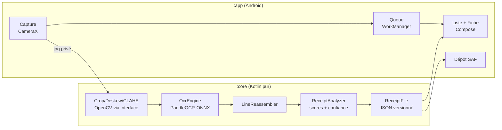

# Architecture Spine — BuKet · Brique 1

**Paradigme : pipeline hors-ligne à source de vérité fichiers.**
Un flux unidirectionnel transforme une photo en fichiers (image + JSON) ;
l'interface n'est qu'une *projection* de ces fichiers. Aucun autre état ne
fait autorité.

## Invariants hérités (PRD, non renégociables ici)

100 % local, zéro réseau · stack 100 % libre · stockage privé d'abord,
dossier SAF ensuite · fichiers versionnés = source de vérité · jamais
d'échec silencieux · confiance annoncée par champ · Apache-2.0 · minSdk 26 ·
appareil de référence S24+ · i18n dès le premier écran.

## Décisions (AD)

**AD-1 [ADOPTED] — Deux modules.**
*Binds* : tout code sans dépendance Android (moteurs d'analyse, formats,
modèles de données) vit dans `:core` (Kotlin pur) ; tout le reste dans
`:app`. *Prevents* : le couplage moteurs↔Android du prototype.
*Rule* : `:core` ne dépend d'aucune API Android ; `:app` dépend de `:core`,
jamais l'inverse.

**AD-2 — Langues.**
*Binds* : code, API, noms de fichiers, messages de commit en **anglais** ;
textes d'interface et documentation utilisateur en **français**, via
resources uniquement. *Prevents* : le mélange incohérent du prototype.
*Rule* : aucun texte utilisateur en dur dans le code.

**AD-3 — Les fichiers sont la vérité.**
*Binds* : un ticket = une paire `<id>.jpg` + `<id>.buket.json` ; la liste,
les compteurs et la file sont **reconstructibles par balayage** du stockage.
*Prevents* : la double vérité fichiers/base. *Rule* : tout index ou cache
local est jetable et se reconstruit sans perte.

**AD-4 — Pipeline à étapes idempotentes.**
*Binds* : `CAPTURED → CROPPED → OCRED → EXTRACTED → DEPOSITED`, orchestré
par WorkManager ; chaque étape lit l'état précédent sur disque, écrit son
résultat sur disque, et peut être relancée sans effet de bord.
*Prevents* : pertes sur kill du process, étapes couplées.
*Rule* : une étape ne parle jamais à une autre qu'à travers les fichiers.

**AD-5 — Privé d'abord, dépôt ensuite.**
*Binds* : la capture écrit dans le stockage privé de l'app ; le dépôt vers
le dossier SAF choisi est une **copie** ; la purge de l'original privé
n'intervient qu'après dépôt confirmé. *Prevents* : toute perte (SAF
révoqué, carte retirée, stockage plein) et toute fuite MediaStore.

**AD-6 — OCR substituable.**
*Binds* : l'OCR est consommé via l'interface `OcrEngine` →
`OcrResult(lines: [text + boundingBox])`. Implémentation brique 1 :
PaddleOCR mobile via ONNX Runtime, modèles embarqués dans l'APK.
*Prevents* : verrouillage sur un moteur. *Rule* : rien en aval de
`OcrEngine` ne connaît le moteur utilisé.

**AD-7 — Extraction dans `:core`.**
*Binds* : portage en anglais des moteurs hérités (`LineReassembler` —
reconstruction géométrique des rangées ; `ReceiptAnalyzer` — scoring
total/date/enseigne/articles/TVA). Chaque champ extrait = valeur +
confiance. *Rule* : champ illisible ⇒ vide + confiance basse — jamais
d'invention (FR-3.3).

**AD-8 — UI mono-activité Compose.**
*Binds* : une activité, un ViewModel par écran, navigation par état simple
(3 écrans : Capture, Liste, Fiche). *Prevents* : sur-architecture navigation
pour 3 écrans. *Rule* : 100 % des textes dans `strings.xml`.

**AD-9 — Jamais d'échec silencieux (opérationnalisé).**
*Binds* : chaque item de la file expose un état visible, dont
`FAILED(reason)` avec relance en un geste. *Rule* : toute erreur montrée
dit quoi faire ensuite.

**AD-10 — Stratégie de test.**
*Binds* : chaque story touchant `:core` livre ses tests JUnit purs ; un
**corpus de tickets réels** (texte OCR anonymisé) est versionné dans les
ressources de test de `:core` — le ticket Quick du prototype y entre
d'office. *Prevents* : la régression du parseur à chaque retour terrain.

**AD-11 — Schéma versionné, lecteurs tolérants.**
*Binds* : `schema_version` (entier) dans chaque JSON ; les champs inconnus
sont ignorés en lecture et **préservés** à la réécriture.
*Prevents* : la casse de « lisible pour toujours » (FR-5.2).

**AD-12 — Identité.**
*Binds* : `applicationId org.buket.app` ; versions semver ; clé de
signature hors git.

## Structure (seed — le code en devient propriétaire)

Arborescence de départ : `core/src/main/kotlin/org/buket/core/{ocr,analyze,format}`,
`app/src/main/kotlin/org/buket/app/{capture,queue,list,detail}`.
Versions de bibliothèques : fixées au spike S-0 (voir Différés) — aucune
version n'est contractuelle dans ce spine.

## Différés (nommés, pas décidés)

Versions exactes des modèles PaddleOCR/ONNX et des bibliothèques (spike
S-0, premier build) · algorithme précis de dédoublonnage (story dédiée) ·
son du bip (bêta) · tickets multi-photos (bêta) · build reproductible
F-Droid · migration vers le dépôt public dédié `buket` (première release
publique) · pré-traitement OpenCV exact pour thermiques pâlis (mesuré sur
la pile réelle).

## Questions ouvertes

Aucune bloquante pour le découpage en stories.
